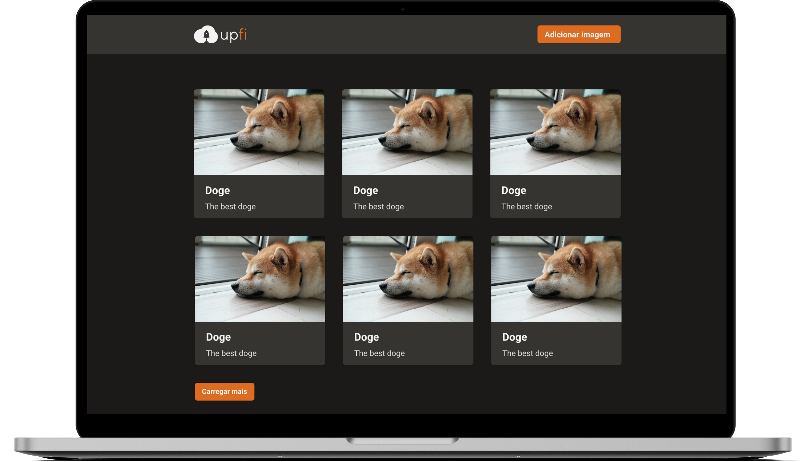

<h1 align="center">
  </img>
</h1>

<p align="center">
  <a href="#ℹ-descrição">Descrição</a> •
  <a href="#-tecnologias">Tecnologias</a> •
  <a href="#-pré-requisitos">Pré-requisitos</a> •
  <a href="#-como-usar">Como usar</a> •
  <a href="#-demonstração">Demonstração</a>
</p>

<p align="center">
  </img>
</p>

## ℹ Descrição

Projeto desenvolvido como desafio principal do capítulo 4 do Ignite. 👨‍🚀🚀

O desafio consistia principalmente em adicionar alguns trechos de código para que a aplicação de upload de imagens funcione corretamente, como regras de negócios e implementação de interfaces com _Chakra UI_ de acordo com o design no _Figma_.

UpFi é uma aplicação para realizar o upload de imagens para a nuvem, sendo possível obtê-las depois. O projeto conta com diversas funcionalidades e integrações, como:

- Salvar dados e exibir as imagens disponíveis do _FaunaDB_ e _ImgBB_;
- Fazer o upload de imagens através do formulário do _React Hook Form_ e validações com _Yup_;
- Queries com _React Query_, permitindo saber o status da query (carregando, erro, sucesso…), se há outra página, cachear dados, entre outros…

## ⚒ Tecnologias

- [**React**](https://pt-br.reactjs.org)
- [**Typescript**](https://www.typescriptlang.org)
- [**Next.js**](https://nextjs.org/)
- [**Chakra UI**](https://chakra-ui.com/)
- [**React Query**](https://react-query.tanstack.com/)
- [**React Hook Form**](https://react-hook-form.com/)
- [**Yup**](https://github.com/jquense/yup)
- [**React Icons**](https://react-icons.github.io/react-icons/)
- [**Axios**](https://axios-http.com/)
- [**FaunaDB**](https://fauna.com/)
- [**ImgBB**](https://pt-br.imgbb.com/)

## ⚙ Pré-requisitos

- [Git](https://git-scm.com)
- [Yarn](https://yarnpkg.com)
- Cadastro no [FaunaDB](https://fauna.com/)
- Cadastro no [ImgBB](https://pt-br.imgbb.com/)
- Editor de código.

## 🖥 Como usar

**Clone o projeto e acesse a pasta**

```bash
$ git clone https://github.com/EduardoReisUX/GoRestaurant && cd GoRestaurant
```

**Siga os passos seguintes**

```bash
# Instale as dependências
$ yarn

# Crie um arquivo ".env.local" que será a cópia de
# ".env.example" e atribua as variáveis de ambiente
$ cp .env.example .env

# Verifique os testes
$ yarn test

# Rode a aplicação
$ yarn dev

# Acesse http://localhost:3000
```

## 👀 Demonstração

🚧 _Quase feito..._

<!-- <p align="center">
</img>
</p> -->

---

<p align="center">Feito com 💜 por <a href="https://github.com/EduardoReisUX">Eduardo dos Reis</a></p>
